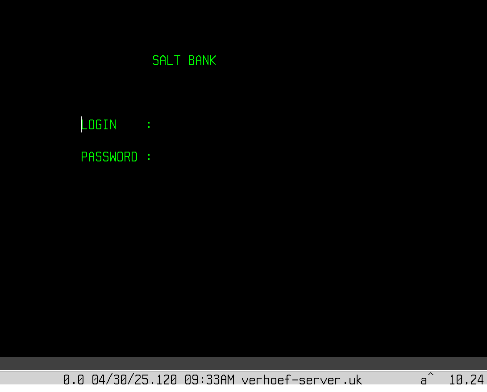
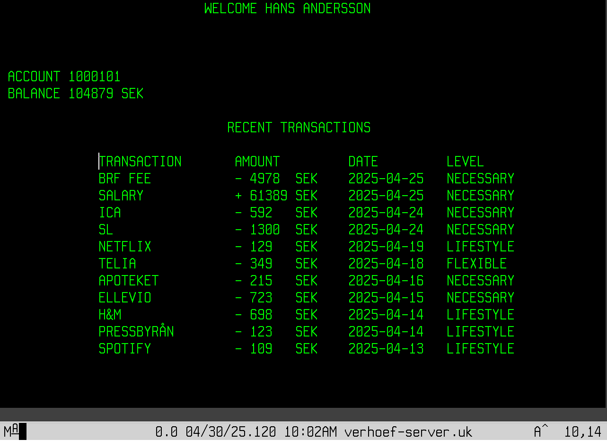

# Mainframe Banking System 🚧

## 🚀 Overview

This project is an early-stage concept of a mainframe-based banking system built using COBOL, CICS, and DB2.

The goal is to explore how a banking application can help users better understand their finances by classifying transactions into categories such as necessary, lifestyle, and flexible spending.

The system is also designed with the idea of providing recommendations based on transaction history, helping users identify unnecessary expenses. In a more advanced version, this could be enhanced with AI-driven insights to suggest ways to reduce lifestyle spending and improve financial habits.

The project focuses on system design, data modeling, and user interaction rather than a fully implemented solution.

---

## 💡 Concept

The system provides a simplified account overview:

* Welcome message with customer name
* Account number
* Current balance
* Transaction list including:

  * Transaction type
  * Amount
  * Date
  * Category (spending level)

This allows users to quickly understand how their money is distributed across different types of expenses.

---

## 🚧 Project Status

This project is a work in progress and was not fully completed.

The focus was on system design, data modeling, and initial CICS/DB2 setup.

---

## ⚙️ Technologies

* COBOL (planned business logic)
* CICS (transaction handling and screen navigation)
* DB2 (data storage)

---

## 🧱 System Setup (CICS)

Example of how the system was configured in CICS:

```cics
CEDA DEF PROG(saltbank) G(DBCG)
CEDA DEF TRANS(bank) G(DBCG) PROG(saltbank)

CEDA DEF DB2E(bane) G(DBCG) AuthID(USER11)
CEDA DEF DB2T(banT) G(DBCG) E(bane) T(bank)

CEDA DEF MAPSET(saltbnk) G(dbcg)
```

---

## 🗄️ Data Model (DB2)

The system is based on three core tables:

### Customer

```sql
CREATE TABLE Custinfo (
    Custid INT GENERATED ALWAYS AS IDENTITY,
    Name   VARCHAR(50),
    DOB    DATE
);
```

### Account

```sql
CREATE TABLE Acctinfo (
    Acctid    INT GENERATED ALWAYS AS IDENTITY,
    Accountnr VARCHAR(20) NOT NULL,
    Balance   DECIMAL(15,2),
    Custid    INT NOT NULL
);
```

### Transactions

```sql
CREATE TABLE Transac (
    Transid     INT GENERATED ALWAYS AS IDENTITY,
    Transaction VARCHAR(20),
    TransDet    VARCHAR(100),
    Amount      DECIMAL(15,2),
    Date        DATE,
    Acctid      INT NOT NULL
);
```

---

## 🤖 Future Vision

The system is intended to support intelligent recommendations based on user spending patterns.

Examples of potential features:

* Highlighting high spending in lifestyle categories
* Suggesting areas where users can reduce unnecessary expenses
* Providing simple budgeting tips based on transaction history
* Potential integration of AI for more advanced financial insights

This reflects how modern banking applications can evolve from transaction systems into decision-support tools.

---

## 📸 Screenshots

### 🔐 Login Screen



Minimal login interface for user authentication.

---

### 💳 Account Overview



Displays customer name, account number, balance, and categorized transactions.

Shows how spending is distributed across:

* Necessary
* Lifestyle
* Flexible

---

## 📚 What I Explored

* Designing a banking system from a user perspective
* Modeling financial data in DB2
* Setting up CICS programs, transactions, and mapsets
* Thinking about how to present financial data clearly to users

---

## 📌 Notes

This repository contains an early-stage version of the system.

COBOL program logic, supporting modules, and database definitions are not included. The focus is on system design and architecture.
